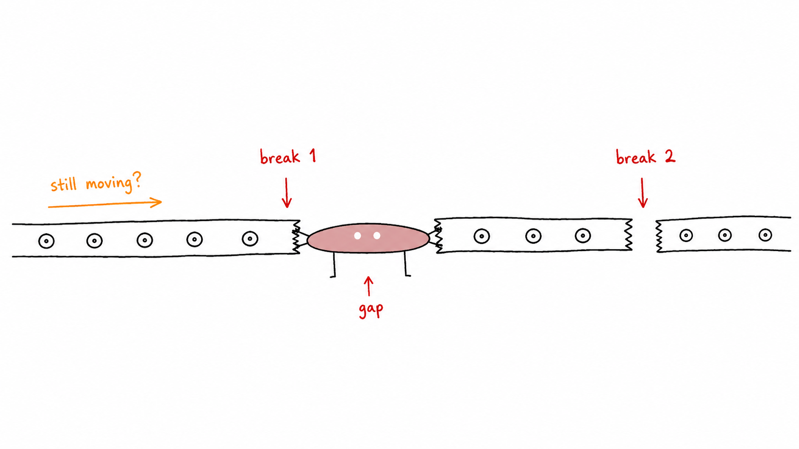
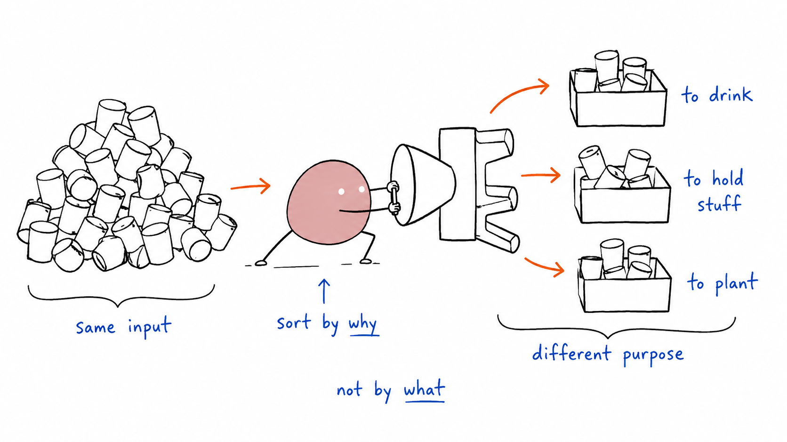
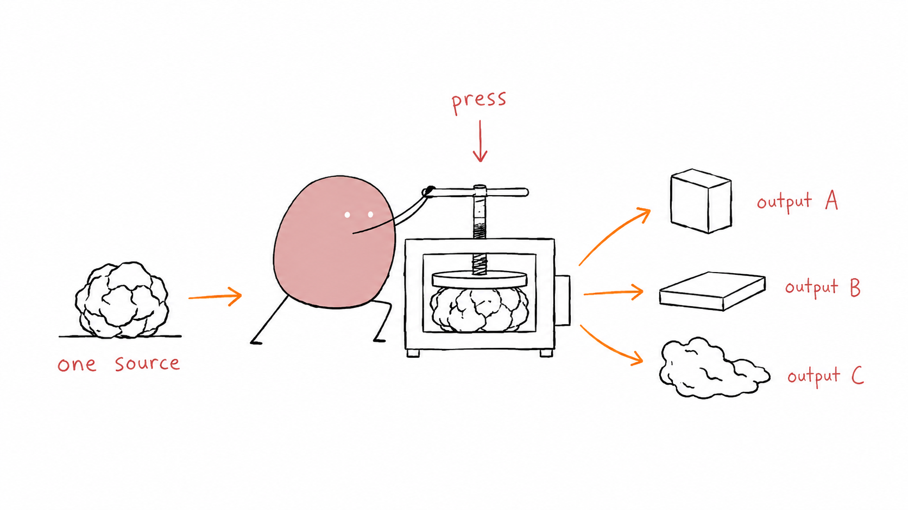
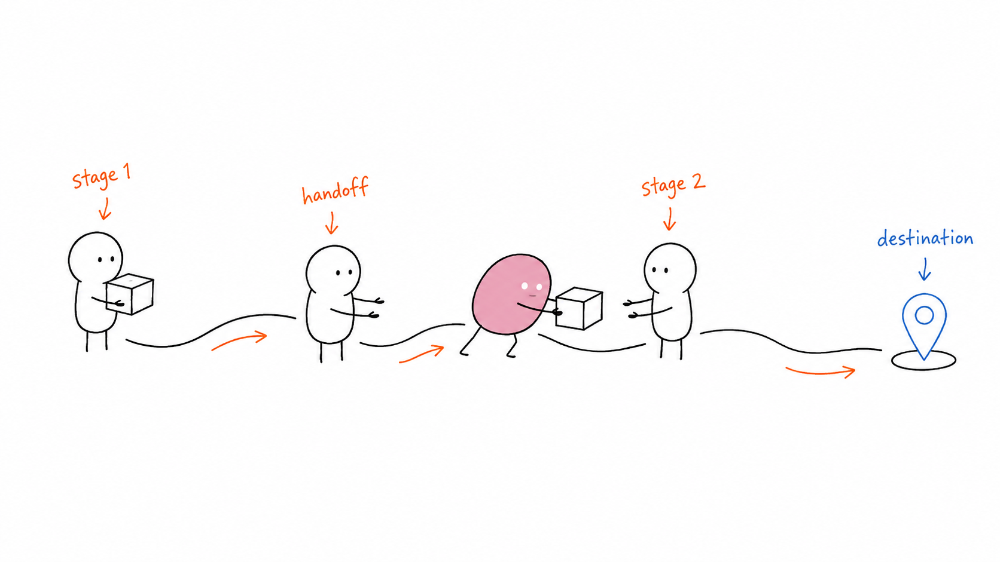
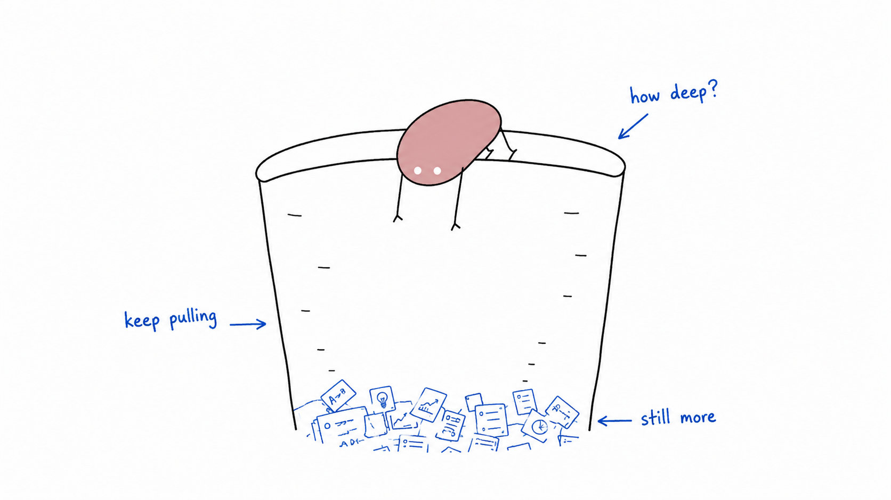
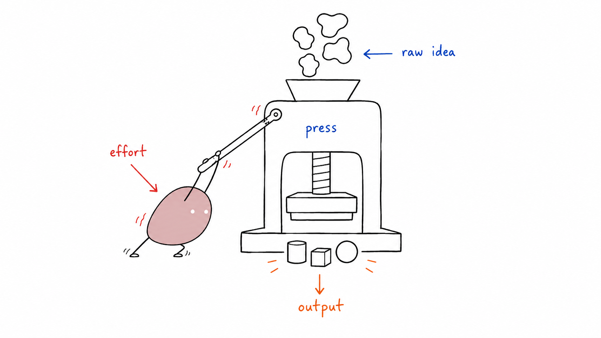
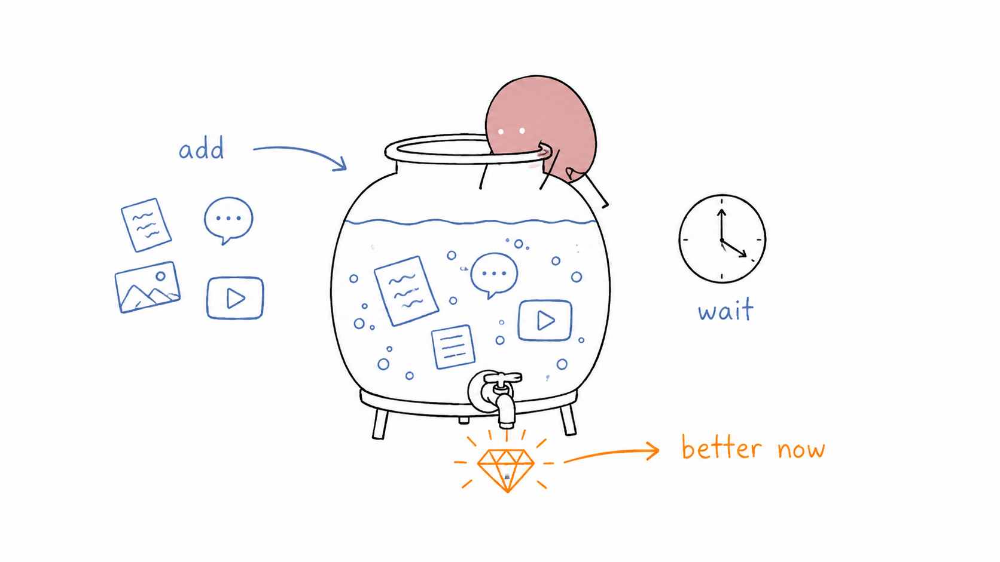
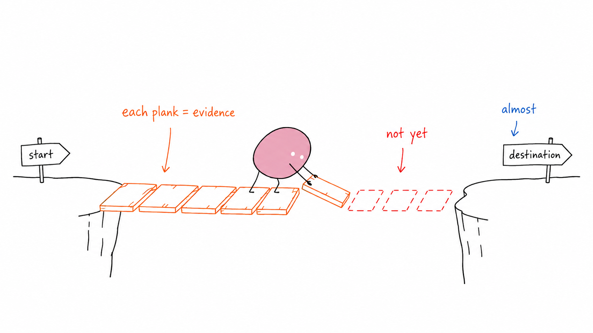

# Ian Xiaohei Illustrations

> Turn the judgments, flows, states, and metaphors from your articles into white-background, hand-drawn, absurd-but-clean inline illustrations.
>
> 16:9 landscape | Xiaohei IP | pure white hand-drawn | sparse handwritten annotations | English & Bahasa Indonesia | Codex Skill

---

## What is this repository

Ian Xiaohei Illustrations is a Codex Skill for guiding AI agents to generate inline illustrations for English and Bahasa Indonesia articles, posts, blogs, Notion documents, and methodology content.

It is not a general illustration prompt, nor a PPT infographic template. Its core goal is: first understand the cognitive anchors in the article, then turn one judgment, flow, structure, state, or metaphor into a memorable 16:9 hand-drawn explanation image.

The default visual IP is "Xiaohei": a solid black character with white dot eyes, thin legs, and a blank expression. Xiaohei is not a mascot, not a sticker, not a corner decoration — but an absurd worker seriously participating in system operations.

One sentence: **Have AI not just "add an image," but actually draw a key cognitive action from the article.**

---

## Who is it for

Especially suited for:

- People writing articles in English or Bahasa Indonesia who need inline illustrations
- People making knowledge content, methodology content, or AI workflow content
- People who want to turn abstract judgments into concrete metaphors
- People who want an illustration style that's lighter, stranger, and more personally recognizable than PPT infographics
- People using Codex for content production who want to stably reuse a consistent visual language

Not suited for:

- People wanting commercial illustrations, brand KVs, or polished flat illustrations
- People wanting traditional PPT infographics, complex architecture diagrams, or flowcharts
- People wanting children's cartoons, cute IPs, or meme-style art
- People wanting to cram large amounts of body text, long explanations, or full course pages into one image
- People needing strictly editable vector source files

---

## What it produces

Default output:

- 16:9 landscape inline illustrations
- A shot list of 4–8 images for one article
- For each image: theme, core meaning, structure type, Xiaohei's action, and suggested annotations
- Final PNG files saved to `assets/<article-slug>-illustrations/` in the workspace

Default non-output:

- PPTX / PDF / Keynote
- SVG / HTML / Canvas editable files
- Commercial posters or cover KVs
- Dense text-based infographics

---

## Visual Style

This skill uses Ian's "Xiaohei Absurd Inline Illustration" style by default:

- Pure white background — no paper texture, cream, shadow, or gradient
- Black hand-drawn line art, thin lines, slight wobble
- Lots of empty space, main subject occupies only about 40%–60% of the canvas
- Sparse red, orange, and blue handwritten annotations in English or Bahasa Indonesia
- One image expresses only one core action, structure, state, or metaphor
- Xiaohei must participate in the core action, not just decorate
- Absurd, creative, clean — not childish, not cute

---

## Example Output

### Two Breakpoints



### Sort by Purpose



### One Fish, Many Uses



### Handoff Path



### Information Well



### Idea Press



### Content Fermentation



### Trust Bridge



These images are style calibration examples, not composition templates. When using the skill, always reinvent metaphors from the current article — do not copy objects or layouts from old examples.

---

## Installation

Clone the repository:

```bash
git clone https://github.com/helloianneo/ian-xiaohei-illustrations.git
cd ian-xiaohei-illustrations
```

Copy the skill to the Codex skills directory:

```bash
mkdir -p "${CODEX_HOME:-$HOME/.codex}/skills"
cp -R ./ian-xiaohei-illustrations "${CODEX_HOME:-$HOME/.codex}/skills/"
```

After installation, use in Codex:

```text
Use $ian-xiaohei-illustrations to design and generate 5 Xiaohei absurd inline illustrations for this Chinese article.
```

---

## How to Use

### Planning Only (No Generation)

```text
Use $ian-xiaohei-illustrations — do not generate images yet.
Analyze this article for illustration opportunities and output a shot list of about 5 images.
For each image, specify: where to place it, theme, core meaning, structure type, what Xiaohei is doing, suggested annotation words.

<paste article>
```

### Generate Inline Illustrations Directly

```text
Use $ian-xiaohei-illustrations to generate 4 Xiaohei absurd inline illustrations for this article.
Requirements: 16:9 landscape, pure white background, black hand-drawn line art, sparse red/orange/blue handwritten annotations.

<paste article>
```

### Generate One Image for a Single Concept

```text
Use $ian-xiaohei-illustrations to generate one inline illustration for "Trust isn't shouted — it's laid down one piece of evidence at a time."
The image should be absurd but clean, and Xiaohei must perform the core action.
```

### Remove a Title or Incorrect Text from an Image

```text
Use $ian-xiaohei-illustrations to edit this image — remove the "Flowchart" title in the top-left corner, keep everything else unchanged.
```

More examples in [examples/prompts.md](examples/prompts.md).

---

## Workflow

This skill's process is:

1. Read the article, Markdown, Notion content, screenshot, or user-provided theme
2. Extract core ideas, cognitive turning points, flow structures, and paragraphs suitable for visualization
3. Output shot list first: each image covers only one cognitive anchor
4. Choose structure type per image: Workflow, System Partial, Before/After Contrast, Character State, Concept Metaphor, Method Layers, Map Route, or Mini Comic Panels
5. Reinvent a low-tech, absurd but plausible physical metaphor
6. Make Xiaohei the agent of the core action
7. Call the image model individually per image
8. Check QA checklist: white background, blank space, Xiaohei action, annotations readable, non-PPT feel, no old-case copies
9. Save final PNGs and report usage and paths

---

## Directory Structure

```text
.
├── README.md
├── LICENSE
├── NOTICE.md
├── assets/
│   └── ian-wechat-qr.jpg
├── examples/
│   ├── images/
│   │   ├── 01-two-breakpoints.png
│   │   ├── 02-sort-by-purpose.png
│   │   └── ...
│   └── prompts.md
└── ian-xiaohei-illustrations/
    ├── SKILL.md
    ├── agents/
    │   └── openai.yaml
    ├── assets/
    │   └── examples/
    └── references/
        ├── style-dna.md
        ├── xiaohei-ip.md
        ├── composition-patterns.md
        ├── prompt-template.md
        └── qa-checklist.md
```

Only the subdirectory needs to be installed into Codex:

```text
ian-xiaohei-illustrations/
```

The root-level README, LICENSE, NOTICE, and examples are GitHub documentation.

---

## Notes

- Keep annotation text inside images short — fewer words are more stable.
- Each image covers only one core structure — don't turn the article into an instruction manual.
- Xiaohei must carry the core action; if removing Xiaohei leaves the image fully intact, Xiaohei is too decorative.
- Example images are only for calibrating line density, empty space, color restraint, and Xiaohei's involvement — do not copy compositions.
- AI image models may produce typos, hallucinated labels, style drift, or extra titles — review after generation.
- If annotation text errors are severe, reduce annotation count and regenerate.

---

## Related Projects

- [Ian Handdrawn PPT](https://github.com/helloianneo/ian-handdrawn-ppt) — Chinese hand-drawn technical PPT-style page illustration generation Skill
- [Awesome Claude Code Skills](https://github.com/helloianneo/awesome-claude-code-skills) — Curated collection of Claude Code Skills / Agents / Plugins
- [Obsidian + Claude AI Second Brain](https://github.com/helloianneo/obsidian-ai-second-brain) — Obsidian + Claude AI personal knowledge base setup guide

---

## About the Author

**Ian** — Product Designer / Solo Business Practitioner / AI Builder

Building a one-person company with an AI team.

- GitHub: [helloianneo](https://github.com/helloianneo)
- X/Twitter: [@ianneo_ai](https://x.com/ianneo_ai)
- Website: [www.ianneo.xyz](https://www.ianneo.xyz)
- WeChat: `ianneoxyz`
- Email: hello.neoc@gmail.com

---

## Keep Exploring

This Xiaohei illustration Skill is just one small tool in the personal production system I'm building with AI.

If you're also using AI for content, knowledge bases, workflows, or productization, visit my website: [www.ianneo.xyz](https://www.ianneo.xyz).

If you just want to observe first, follow me on [X/Twitter](https://x.com/ianneo_ai).

For Indie Builders Club, add WeChat: `ianneoxyz`, note "OPC".

<p>
  
</p>

Can't scan the QR code? Search WeChat: `ianneoxyz`.

---

## License

MIT License. See [LICENSE](LICENSE).
